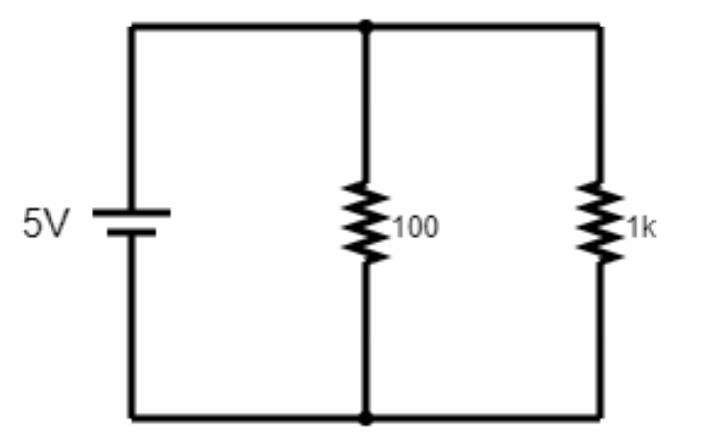
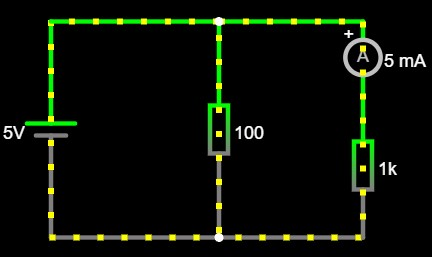
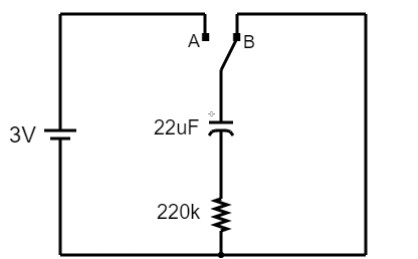

## Plataformas de Hardware para Internet das Coisas
### Docente: Luiz de França Afonso Ferreira Filho
### Discente: Leandro Antony Batista Lemos

# Exercício 01
Dado o seguinte circuito:

1. Link falstad: https://www.falstad.com/s.php?s=qbBc0D

2. Calculemos a tensão e a corrente que passa pelo resistor de 1k.
Como trata-se de uma associação em paralelo entre resistores, a tensão que se aplica ao nó é igual à tensão percorrendo cada um dos resistores. Portanto, $V_{R_{1k}} = 5V$.
Tendo conhecimento de que $V_{R_{1k}} = 5V$, a corrente $I_{R_{1k}}$ pode ser calculada a partir da Lei de Ohm. $I_{R_{1k}} = \frac{V_{R_{1k}}}{R_{1k}}$, dado isso, teremos a seguinte equação: $I_{R_{1k}} = \frac{5}{1k} = \frac{5}{10^3} = 0,005A = 5mA$.

3. A medição via multímetro da corrente que passa no resistor $1k$ no simulador do falstad é de $5mA$

4. Como podemos observar na imagem acima, o valor medido na simulação condiz exatamente com o valor de corrente obtido através dos cálculos.

5. Pode-se dizer que não pois na vida real existem alguns fatores terceiros que podem influenciar nessa variável como a tolerância do resistor, resistência interna da fonte de energia, ou até mesmo fenômenos naturais como o aumento de temperatura. Todos os fatores mencionados podem influenciar no valor da corrente que percorrerá o resistor de 1k.

# Exercício 02: Carga e descarga de capacitores
Dado o seguinte circuito:

1. Link falstad: https://www.falstad.com/s.php?s=pPx6pV

2. A constante de tempo é calculada através da seguinte relação $\tau = R \cdot C$, onde $\tau$ é a constante de tempo, R é a resistência e C é a capacitância. Calculemos a constante de tempo desse circuito: $\tau = 220k \cdot 22\mu F = 22 \cdot 10^4 \cdot 22 \cdot 10^{-6} = 484 \cdot 10^{-2} = 4,84s$.

3. O tempo que o capacitor levou para carregar 1,9V foi de 4,853s no simulador.

4. 1. O tempo medido no simulador com o tempo calculado pela fórmula da constante de tempo foi semelhante, pois esse tempo é justamente o tempo que o capacitor leva para carregar-se à 63,2% da carga total, o simulador aproxima-se desse valor pois faz cálculos com as mesmas variáveis utilizadas na fórmula.
    2. Caso a resistência do resistor presente for alterada de 220k para 100k, o tempo para que o capacitor carregue 1,9V será menor. A explicação mais direta para esse resultado é devido o tempo ser proporcional à resistência, logo se a resistência diminuir, então o tempo para carregar 1,9V também diminuirá. Faremos o cálculo de $\tau = 10^5 \cdot 22 \cdot 10^{-6} = 22 \cdot 10^{-1} = 2,2s$, como pode ver a diferença entre o tempo com o resistor de $220k\Omega$ onde obtivemos tempo de 4,84s para com o resistor de $100k\Omega$ onde obtivemos o tempo de $2,2s$.
5. Ao conectar o capacitor de volta ao terminal B, é possível notar o descarregamento do capacitor, o capacitor passa a agir como fonte, fornecendo a energia que carregou. Graficamente, a tensão decresce de forma exponencial também, partindo do valor final atingido na carga (V) até se aproximar de 0V. Essa queda segue a curva descrita pela constante de tempo τ = RC: após 1τ, restam aproximadamente 36,8% da tensão inicial; após 3τ, restam apenas cerca de 5%; e, na prática, considera-se o capacitor totalmente descarregado após 5τ.