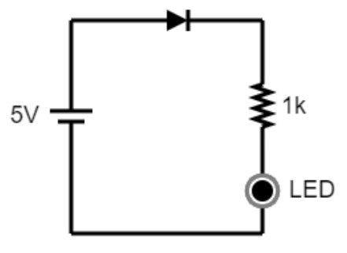
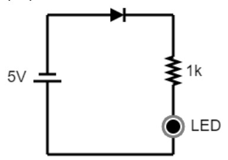
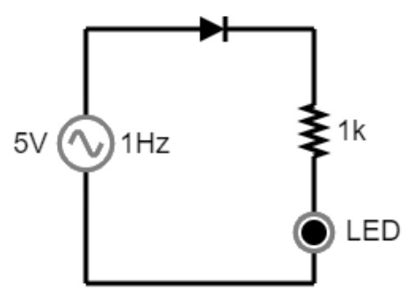
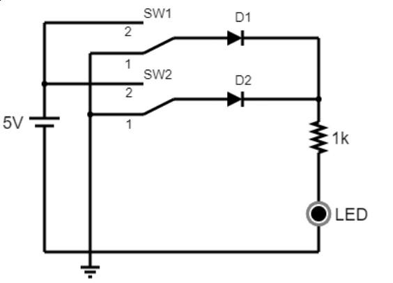
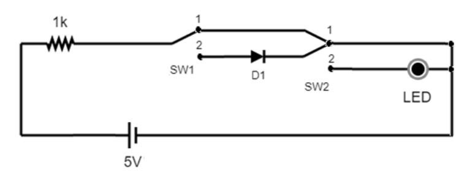

## Plataformas de Hardware para Internet das Coisas
### Docente: Luiz de França Afonso Ferreira Filho
### Discente: Leandro Antony Batista Lemos

# Exercício
- Observação: Nos experimentos, todos os diodos devem ter o modelo “default” e os leds
devem ser vermelhos e com o modelo “default-led”.

## Experimento 01: Polarização direta versus Polarização reversa de diodos.
Dado o circuito: 

1. Link falstad: https://www.falstad.com/s.php?s=B88O0X
O comportamento do LED é permanecer aceso enquanto houver alimentação pela fonte. O LED só está acionado devido ao à polarização direta do diodo, caso contrário, não haveria passagem de corrente elétrica.
2. A tensão medida em cima do resistor de 1k é de 2,835V. A tensão sobre esse resistor se dá inferior à 5V pela 2° Lei de Kirchhoff:$$V_{fonte} = V_{diodo} + V_R + V_{LED}$$ O LED e o diodo em polarização direta possuem quedas de tensão  próprias, as quais se subtraem da tensão provida pela fonte, dessa forma o restante sobra para o resistor.
3. Para calcular a corrente que passa pelo resistor de 1k, tendo em mente que o LED opera em nível de tensão de 1,7V e o diodo com 0,7V. Encontraremos a tensão que está no resistor, portanto, faremos pela 2° lei de Kirchhoff: $$5 = 1,7 + V_R + 0,7 \implies V_R = 5-2,4 \implies V_R = 2,6V$$
Dado isso, calcularemos a corrente que passa no resistor através da Lei de Ohm:
$$I_R = \frac{V_R}{R}$$ substituindo os valores, teremos $$I_R = \frac{2,6}{10^3} = 2,6mA$$
O valor calculado não é igual ao medido, mas por conta de que a tensão calculada(2,6V) não é igual à tensão medida(2,835V), mas nota-se que as correntes se obtém da mesma maneira, visto que a calculada foi $2,6mA$ e a medida foi $2,835mA$. Dito isso, se as tensões fossem iguais, as correntes calculada e medida também seriam iguais.

Dado o circuito:

4. Link falstad: https://www.falstad.com/s.php?s=NSPhir
O comportamento do LED é permanecer apagado e isso ocorre devido a polarização invertida do diodo impedindo a passagem de corrente elétrica, consequentemente impedindo que o LED seja ligado.
5. A diferença entre os dois circuitos de polarização realizados neste roteiro se encontra no sentido que a fonte se direciona, no circuito 1 era feito com o lado positivo sentido à favor do diodo, no circuito 2, a fonte está com o lado positivo contra o diodo.
6. Refazendo o circuito da polarização invertidasem o diodo, pode-se afirmar que o comportamento do LED permaneceu o mesmo. A razão para esse fenômeno é de que o LED em si é um diodo (Light Emitting Diode), dessa forma, quando está polarizado inversamente, ele barra a passagem de corrente elétrica, e quando está polarizado diretamente o LED acende normalmente, pois diodo permite passagem de corrente elétrica.

Dado o circuito:

7. a) O LED acende a cada semiciclo positivo, e ele fica aceso na frequência de 1Hz, uma vez por segundo durante o semiciclo positivo.
    b) A tensão no resistor de 1k quando o sinal senoidal permanece no eixo da tensão negativa ela é quase nula considerado um valor nulo. O motivo desse comportamento se dá pela razão de que quando a tensão alternada permanece no eixo negativo, o circuito entra me polarização inversa bloqueando a passagem de corrente elétrica e consequentemente impedindo o acendimento do led.

## Experimento 02: Portas lógicas com Diodos
Dado o circuito:

1. Link falstad: https://www.falstad.com/s.php?s=rvwhSK

2. O circuito acima representa a porta lógica OR, onde basta uma das entradas ser 1 para que a saída seja 1, ou seja, basta ligar uma das entradas como 1 para que o LED acenda.

3. Link falstad: https://www.falstad.com/s.php?s=LjaJ4e

4. O circuito acima representa a porta lógica AND, onde ambas entradas precisam ser 1 para que a saída seja um, no caso, para que o LED acenda.